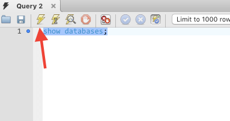
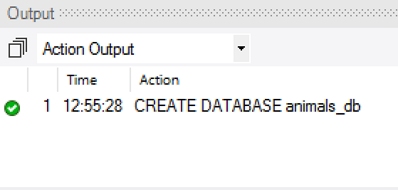
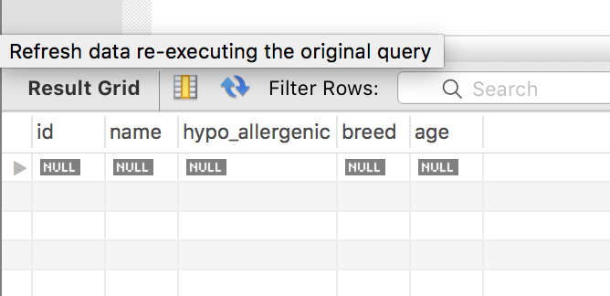

# SQL Reference Guide

 

- - -

## Background

_What is SQL? MySQL?_

**S**tructured **Q**uery **L**anguage is a programming language used to query and manipulate data stored within relational databases.

**MySQL** is open source software that can be placed on a server, allowing SQL commands to access the data stored there.

## SQL Cheat Sheet

The purpose of this guide is to provide users with the SQL commands commonly used while working in the MySQL Workbench.

- - -

### MySQL Workbench Basics

**To execute** a line or block of completed code, click the lightning bolt symbol at the top of the editor.



**To confirm** code has been successfully run or to troubleshoot bugs, the `Action Output` section at the bottom of the editor provides the appropriate feedback.



This image demonstrates the successful creation of a new database (called `animals_db` in this example).

- - -

### Creating a Database

```sql
CREATE DATABASE animals_db;
```

When the above command is entered in the MySQL Workbench editor, a new database will be created on the server the user is connected to.

**Hint**: _A new database will only be created if it does not already exist. To delete, or drop, an existing database, first run `DROP DATABASE <database_name>;`, then `CREATE DATABASE <database_name>;`. Use care before deleting a database!_

Note the semicolon at the end of the statement. This character tells MySQL that the line of code is complete. This is an important facet of SQL syntax: forgetting the semicolon will result in errors and non-functional code.

**Remember** to reload the connection for the new database to appear within the navigator.

- - -

### Creating a Table

```sql
USE animals_db;

CREATE TABLE people (
  name VARCHAR(30) NOT NULL,
  has_pet BOOLEAN NOT NULL,
  pet_name VARCHAR(30),
  pet_age INTEGER(10)
);
```

**Code Breakdown:**

1. `USE animals_db;` tells SQL the specific database we wish to access.

2. `CREATE TABLE people` is the line that creates and names a table within `animals_db`.

Within parentheses, we define the data the table will hold. Similar to the headers on an Excel spreadsheet, `name`, `has_pet`, `pet_name` and `pet_age` define the data to be inserted.

Let's picture the table we've created as a fancy Excel spreadsheet:

* `name VARCHAR(30) NOT NULL` states that the column header is `name` and each row of data within the column will be a string up to 30 characters in length.

  * Adding `NOT NULL` specifies that the "cell" cannot be empty - it must contain data.

* The `has_pet BOOLEAN NOT NULL` line stipulates whether the person in the preceding column has a pet or not. The data in this column is either `TRUE` or `FALSE` and cannot be left blank.

* `pet_name VARCHAR(30)` states that the column will contain a string of characters, though this column's values can remain empty.

* `pet_age INTEGER(10)` specifies that the column will contain numerical data, if it exists.

- - -

### Viewing the Table

```sql
SELECT * FROM animals_db;
```

Using the line of code above, a visual of the new (empty) table will be created.



- - -

### Adding Data

Now that a table has been created, let's insert data.

```sql
INSERT INTO people (name, has_pet, pet_name, pet_age)
VALUES ("Jacob", true, "Misty", 10);

SELECT * FROM people;
```


In the above example, we...

1. Specify which table and columns we will be inserting data to.

2. Assign values to the corresponding columns. This is equivalent to adding a row of data in Excel.

3. Create a view of the table with its new values.

- - -

### Primary Keys

```sql
CREATE TABLE people (
  -- Add a numeric auto_increment id column --
  id INTEGER(11) AUTO_INCREMENT NOT NULL,
  name VARCHAR(30) NOT NULL,
  has_pet BOOLEAN NOT NULL,
  pet_name VARCHAR(30),
  pet_age INTEGER(10),
  -- Assign a primary key --
  PRIMARY KEY (id)
);
```

The table we're creating now is almost exactly the same as earlier, with the exception of adding an `id` column and assigning it as the `primary key`.

The `id` column will auto-increment by one with the addition of each row of data. In doing so, it provides each row with a unique identifier. Removing duplicates or inserting data at a specific point becomes an easier process with a unique `id` column.

- - -

### SQL Joins

Joins are used to combine two or more tables using a common shared value.

There are three main types of joins used in MySQL:

* `INNER JOIN`: Used to join two tables that share a matching column.


  ```sql
  SELECT column(s) FROM table_1
  INNER JOIN table_2
  ON table_1.column_name = table_2.column_name;
  ```

* `LEFT JOIN`: Combined tables will show all values of the first specified table (the left side) while only the matching values from the second table (on the right side) will be shown.


  ```sql
  SELECT column(s) FROM table_1
  LEFT JOIN table_2
  ON table_1.column_name = table_2.column_name;
  ```

* `RIGHT JOIN`: Only the values matched on the first (left) table will be shown, but all values from the second (right) table will be shown.


  ```sql
  SELECT column(s) FROM table_1
  RIGHT JOIN table_2
  ON table_1.column_name = table_2.column_name;
  ```

- - -

### Queries

Specific data within a table can be returned with queries. In the below example, our query returns only the rows containing specific `value` in `column_a`.

```sql
SELECT * FROM table_1
WHERE column_a = value;
```

The query can be expanded to include multiple values using `AND`:

```sql
SELECT * FROM table_1
WHERE column_a = "value" AND column_b = "value";
```

Alternatively, the query can return data containing either one value or another, using `OR`:

```sql
SELECT * FROM table_1
WHERE column_a = "value" OR column_b = "value";
```

Certain data can also be excluded from a query using the statement `WHERE NOT`:

```sql
SELECT * FROM table_1
WHERE NOT column_a = "value";
```

Using the `IN` operator with a `WHERE` clause allows users to specify multiple values in their query:

```sql
SELECT * FROM table_1
WHERE column_a IN ("value_a", "value_b");
```

Similarly, `NOT IN` excludes certain values from a query:

```sql
SELECT * FROM table_1
WHERE column_a NOT IN ("value_a", "value_b");
```

- - -
